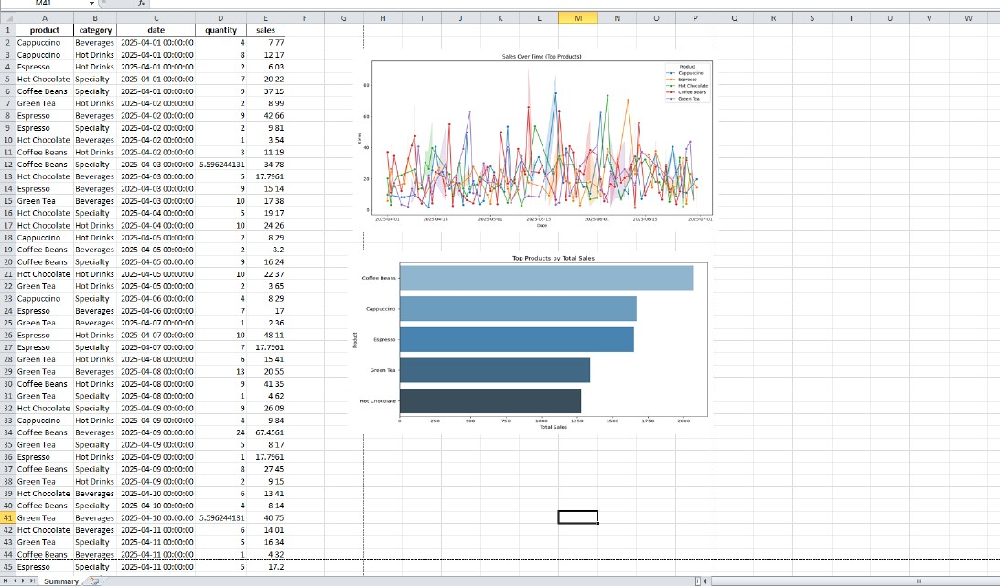
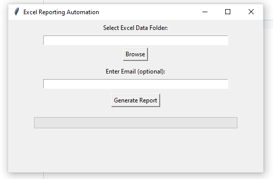
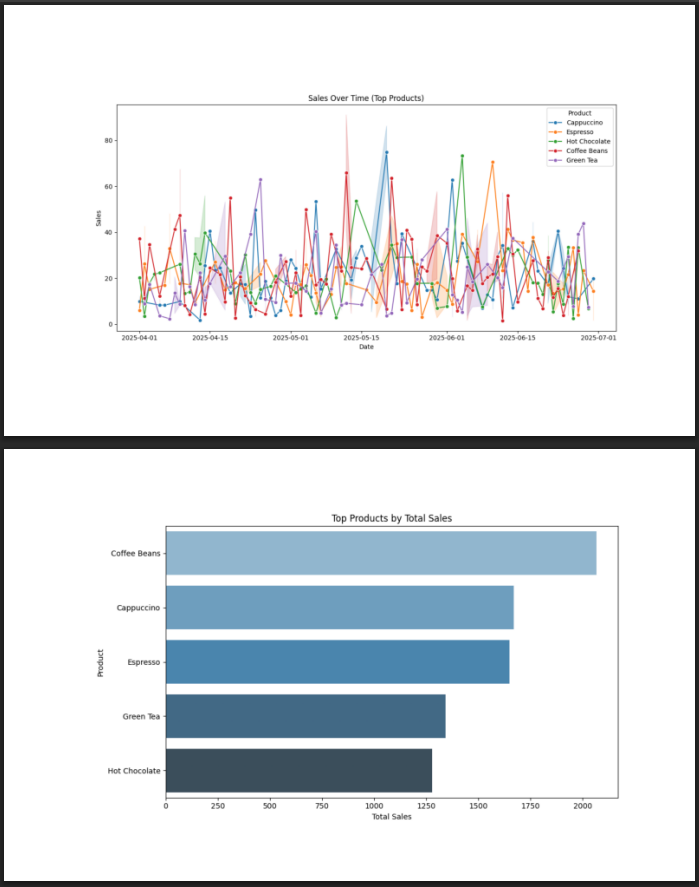

# Excel Report Automation Tool (Python + TKinter)

An end-to-end Python tool to automate Excel-based reporting workflows for small businesses and analysts.

## Features

- Merge and consolidate multiple Excel workbooks
- Data cleaning: remove duplicates, handle missing values (mean/mode), normalize formats
- Business logic: group by Product, Category, Date; compute sales metrics
- Generate trend charts and performance visualizations (Matplotlib/Seaborn)
- Export cleaned data and insights to Excel and PDF
- [Optional] Email the report using `yagmail`
- Tkinter-based GUI with progress bar and email input
- 🪄 Ready for one-click packaging as a `.exe`

## Repository Structure

```arduino
excel_report_automation/
├── data/                  # Sample or real input Excel files
│   └── [sample Excel files here]
├── output/                # Output reports (Excel & PDF)
│   ├── final_report.xlsx
│   └── final_report.pdf
├── charts/
│   └── [auto-generated PNGs]
├── config/
│   └── settings.json (optional for customization)
├── src/
│   ├── main.py              # CLI entry point
│   ├── gui_main.py          # GUI entry point
│   ├── cleaner.py
│   ├── plotter.py
│   ├── reader.py.py
│   ├── analyzer.py
│   ├── reporter.py
│   └── gui.py
└── README.md
```

### How It Works

1. Drop raw Excel files into `data/`
2. Launch GUI:

   ```bash
   python gui_main.py
   ```

3. Click **Generate Report** → App:

- Merges files
- Cleans data
- Applies business logic
- Generates charts
- Saves output to `output`

4. Optionally send output via email

### Sample Output

- `output/final_report.xlsx` — Clean, summary report with KPIs
- `output/summary.pdf` — PDF version with embedded charts

### Screenshot

#### Example Screenshots

| Excel Report Output | GUI Interface | PDF Report |
|:-------------------:|:-------------:|:----------:|
|  |  |  |

📸 Screenshots available in the `/screenshots` folder (add yours).

### Executable Build

This tool has been packaged into an .exe using PyInstaller for clients without Python.
**Not included here.**

Build instructions (if needed):

```bash
pyinstaller --onefile --noconsole gui_main.py
```

### 📩 Email Function (Optional)

If enabled, the app can send the report to a specified email using `yagmail`.

Set up:

```bash
pip install yagmail
yagmail.register('youremail@gmail.com', 'your-app-password')
```

### Requirements

- Python 3.8+
- Pandas, Numpy, Seaborn, Matplotlib, Tkinter, yagmail

```bash
pip install -r requirements.txt
```

### License

MIT - feel free to adapt, fork, and build on this.

Open to feedback or future enhancements. Let's connect.
